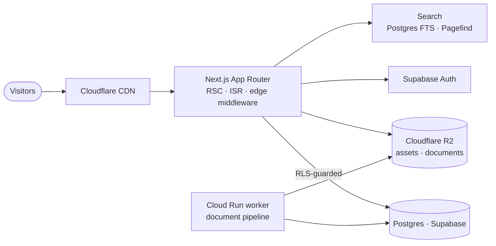

# Hi, I'm Sourabh 👋

  
  
  

<i>I design and build production web platforms end to end — architecture, data model, performance, and the last pixel.</i>

---

### 🏗️ How I build

- **Schema first.** The database and its RLS policies are the source of truth — not the UI, not the API.
- **Cache like the bill depends on it.** ISR, on-demand revalidation, and edge middleware keep pages instant and infra cheap.
- **Performance is a feature.** Core Web Vitals and query latency are measured and budgeted, never guessed.
- **One pair of hands.** I own the architecture *and* the design — fewer handoffs, tighter results.
- **Vibe coder, and proud of it.** I lean on the tools, keep the judgment, and ship.

### 🗺️ A system I run in production

A real, running stack: edge-cached pages, row-level-secured data, object storage, and a scale-to-zero worker for heavy jobs.

### 🧰 Stack I reach for

  
  
  
  
   
  
  
  
  

### 🛠️ What I'm building

A **forensic-science journal, community, and library** on the web — a layered platform
(content, community, library, authority) built to scale to a million readers. End to end:
schema and RLS, editorial tooling, search, performance, and design.

> 🔭 **Currently:** pushing the platform's edge performance and SEO authority toward its first big traffic milestone.

### 📈 Activity

  

---

  Most of my work lives in private repos — the graph is quieter than the keyboard.
    
  

